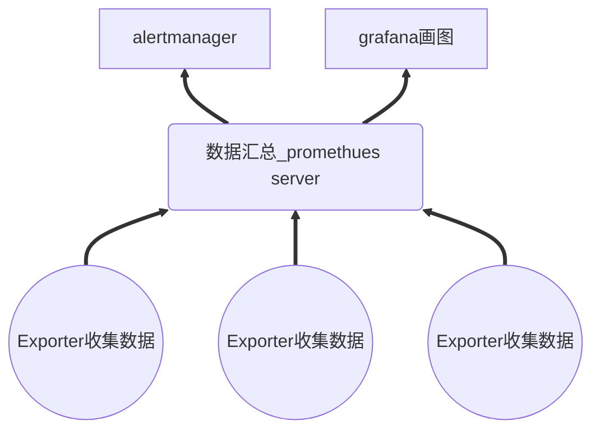
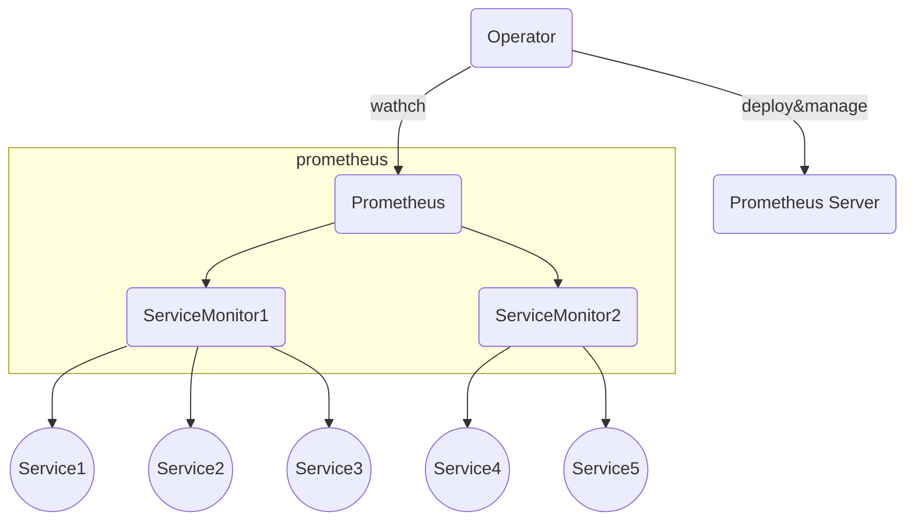
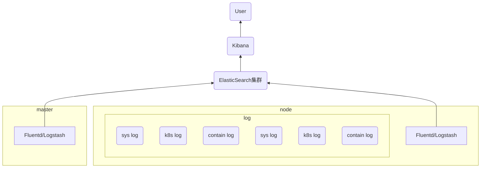

[toc]


# helm 简介

helm 类似 linux 下面的包管理器 apt-get/yum，能够快速的把 yaml 文件安装进 k8s，且能够方便解决不同环境的配置问题。

## helm3 与 helm2

helm3 与 helm2 的主要区别在于：

1. 移除 Tiller
    - helm3 移除了其服务器端组件，Tiller，现在完全没有代理。
    - Tiller 之前是一个运行在 Kubernetes 上的小型应用程序，它用于监听 Helm 命令并处理设置 Kubernetes 资源的实际工作。
    - helm3 使用与 kubectl 上下文相同的访问权限
    - 无需再使用 helm init 来初始化 Helm
    - Release Name 位于命名空间中
2. 分布式仓库以及 Helm Hub
    - Helm 命令可以从远程仓库安装 Chart。类似 docker hub
    - helm3 可以添加多个远程仓库，从远程仓库进行安装
    - helm3 命令可以直接在 Helm Hub 中寻找 Chart
3. JSON Schema 验证
    - 从 Helm 3 开始，chart 维护者可以为输入值定义 JSON Schema。这一功能的完善十分重要，因为迄今为止你可以在 values.yaml 中放入任何你所需的内容，但是安装的最终结果可能不正确或出现一些难以理解的错误消息。
    - Helm 3 默认添加了针对 Kubernetes 对象的 OpenAPI 验证，这意味着发送到 Kubernetes API 的请求将会被检查是否正确。
4. helm3 相较与 helm2 命令行有些改变


# helm3 安装

## 源码安装

1. 下载 helm3对应版本的源码包，地址为：https://github.com/helm/helm/releases
2. 解压 tar 包。例如：`tar -zxvf helm-v3.0.0-linux-amd64.tar.gz`
3. 找到文件夹中的 helm 二进制文件，将其拷贝到可执行目录中。例如：`mv linux-amd64/helm /usr/local/bin/helm`


## 脚本安装

1. 下载安装脚本：`curl -fsSL -o get_helm.sh https://raw.githubusercontent.com/helm/helm/master/scripts/get-helm-3`
2. 给脚本可执行权限：`chmod 700 get_helm.sh`
3. 执行脚本：`./get_helm.sh`


##  helm 命令使用 tab 键补全

1. 创建 helm 的配置文件 .helmrc
```shell
helm completion bash > ~/.helmrc
```
2. 将 helm 的配置 加载到 bashrc 中
```shell
echo "source ~/.helmrc" >> ~/.bashrc
```
3. 重新加载 bashrc
```shell
source .bashrc
```


# helm3 命令使用

## 仓库管理

kubernetes 官方的 package 的 helm 查询网站在：https://artifacthub.io/


仓库管理命令列表：
- `helm repo add` - 添加 chart 仓库
    - `helm repo add [NAME] [URL] [flags]`
- `helm repo index` - 生成一个包含打包图表的目录的索引文件
    - `helm repo index [DIR] [flags]`
- `helm repo list` - 查看 chart 仓库
    - `helm repo list [flags]`
- `helm repo remove` - 删除一个或多个 chart 仓库
    - `helm repo remove [REPO1 [REPO2 ...]] [flags]`
- `helm repo update` - 从 chart 仓库本地更新可用 chart 的信息
    - `helm repo update [flags]`    


注意：**国内常用的仓库有**：
- 阿里云的源 : https://apphub.aliyuncs.com
- 微软 azure 的源 : http://mirror.azure.cn/kubernetes/charts/


实例：
1. 添加 chart 仓库
2. 查看 仓库
```shell
[root@k8s-master ~]# helm repo add ali https://apphub.aliyuncs.com
"ali" has been added to your repositories
[root@k8s-master ~]# helm repo add azure http://mirror.azure.cn/kubernetes/charts/
"azure" has been added to your repositories
[root@k8s-master ~]# helm repo list
NAME    URL
ali     https://apphub.aliyuncs.com
azure   http://mirror.azure.cn/kubernetes/charts/

```

## 搜索 相关软件 chart

两种搜索方式：

- `helm search repo` : 从 repo仓库中搜索 
    - `helm search repo [keyword] [flags]`
    - `helm search repo nginx`
- `helm search hub` : 从 官方 https://hub.helm.sh 搜索软件包
    - `helm search hub [keyword] [flags]`


## 部署应用

1. `helm pull` : 从仓库下载图表，并(可选地)将其解压缩到本地目录中。类似 docker pull，下载到本地。
    - `helm pull [chart URL | repo/chartname] [...] [flags]`
2. `helm install` : 可以直接安装，也可以下载下来后再安装
    - `helm install [NAME] [CHART] [flags]`
    - **有五种不同的方式可以安装的chart:**
        1. <u>通过 仓库 安装</u>： `helm install mymaria example/mariadb`
        2. <u>通过一个打包好的 chart 文件</u>: `helm install mynginx ./nginx-1.2.3.tgz`
        3. <u>通过一个文件夹中的解压后的文件</u>: `helm install mynginx ./nginx`
        4. <u>通过网络路径安装</u>: `helm install mynginx https://example.com/charts/nginx-1.2.3.tgz`
        5. <u>通过指定repo仓库安装</u>：`helm install --repo https://example.com/charts/ mynginx nginx`


对解压后的压缩包的说明：
```shell
[root@k8s-master helm]# helm pull azure/mysql
[root@k8s-master helm]# ls
mysql-1.6.7.tgz
[root@k8s-master helm]# tar zxvf mysql-1.6.7.tgz

[root@k8s-master helm]# cd mysql/
[root@k8s-master mysql]# ls
Chart.yaml  README.md  templates  values.yaml
```

说明：
- `Chart.yaml` 是 chart 的描述信息
- `README.md` 是此 chart 的帮助信息
- `templates` 目录里是各种模板，比如定义 svc，定义 pvc 等
- `values.yaml` 里记录的是 chart 的各种信息，比如镜像是什么，root 密码是什么，是否使用持久性存储等


## 验证 yaml 文件格式

- `helm lint PATH [flags]` : 检查chart中可能出现的问题


## 查看已部署应用

注意：  
**Release: 使用 Helm install 命令在 Kubernetes 集群中安装的 Chart 称为 Release**

1. `helm list [flags]` : list release
    - 默认情况下，它只列出已部署或失败的版本。
    - 默认情况下，项目按字母顺序排序。使用 '-d' 标志按发行日期排序。
    - 如果提供了 `--filter` 标志，它将被视为一个过滤器。过滤器是应用于发布列表的正则表达式。只返回与筛选器匹配的项。
2. `helm status RELEASE_NAME [flags]` : 显示 指定 release 的状态，状态信息包括：
    - 最后部署时间
    - k8s 命名空间
    - 状态(可以是: unknown, deployed, uninstalled, superseded, failed, uninstalling, pending-install, pending-upgrade or pending-rollback)
    - 这个版本包含的资源列表
    - 最后一次测试套件运行细节
    - 附加 notes 提供的chart
3. `helm show all [CHART] [flags]` : 显示指定目录下 chart 的所有信息
4. `helm show chart [CHART] [flags]` : 显示指定目录下 chart 的定义，也就是 Chart.yaml 文件的内容
5. `helm show readme [CHART] [flags]` : 显示指定目录下 chart 的 readMe 信息，也就是 README.md 文件的内容
6. `helm show values [CHART] [flags]` : 显示指定目录下 chart 的 values 信息，也就是 values.yaml 文件的内容


## 自定义chart

- `helm create NAME [flags]` : 创建指定名称的 chart
```shell
foo/
├── .helmignore   # Contains patterns to ignore when packaging Helm charts.
├── Chart.yaml    # Information about your chart
├── values.yaml   # The default values for your templates
├── charts/       # Charts that this chart depends on
└── templates/    # The template files
    └── tests/    # The test files
```


## 打包

- `helm package [CHART_PATH] [...] [flags]` : 将一个 chart 目录打包成 压缩包


## 查看 release 的历史版本

- `helm history RELEASE_NAME [flags]` :  查看 release 的历史版本


## 卸载应用

- `helm uninstall RELEASE_NAME [...] [flags]` : 卸载指定应用


# helm 搭建私有仓库

## 推送到私有仓库
将自己写的包推送到私有仓库，有以下几个步骤：
- 搭建私有仓库
- 写好自己的 chart 文件
- 将 chart 文件打包
- 创建包的索引文件
- 把包推送到私有仓库    


## 搭建私有仓库
1. 运行web容器作为私有仓库
    - 在一台新的机器上，搭建私有仓库，IP 地址为 10.113.69.133
    - 首先使用的是 httpd 镜像，其实其他镜像也可以，例如 nginx
    - 将本地目录 /k8s-proxy/helm-repo/ 映射到容器中
    - 在本地目录 /k8s-proxy/helm-repo/ 中写自己的 chart 文件
```shell
//  拉取httpd镜像
[root@localhost helm-repo]# docker pull httpd
Using default tag: latest
latest: Pulling from library/httpd
bb79b6b2107f: Already exists
26694ef5449a: Pull complete
7b85101950dd: Pull complete
da919f2696f2: Pull complete
3ae86ea9f1b9: Pull complete
Digest: sha256:b82fb56847fcbcca9f8f162a3232acb4a302af96b1b2af1c4c3ac45ef0c9b968
Status: Downloaded newer image for httpd:latest
docker.io/library/httpd:latest

//  启动容器
[root@localhost helm-repo]# docker run -d -p 8989:80 -v /root/k8s-proxy/helm-repo/:/usr/local/apache2/htdocs httpd
5b9e7a482a69c0ec5ce67d9fd8aa5a497ae41379a692c42c00538fbb583aa48c

// 在映射的目录中创建 charts 目录
[root@localhost helm-repo]# pwd
/root/k8s-proxy/helm-repo
[root@localhost helm-repo]# mkdir charts

```
2. 通过 helm package 将自己建的 chart 打包
    - 创建一个自定义文件夹，里面存放自定义的chart文件
    - 创建 testechart，`helm create testchart`
    - 进行打包，`helm package testchart`
```shell
// 创建目录
[root@k8s-master helm]# mkdir myrepo-test
[root@k8s-master helm]# cd myrepo-test/

//  创建 charts
[root@k8s-master myrepo-test]# helm create testchart
Creating testchart
[root@k8s-master myrepo-test]# ls
testchart

//  打包
[root@k8s-master myrepo-test]# helm package testchart/
Successfully packaged chart and saved it to: /root/learn-k8s/helm/myrepo-test/testchart-0.1.0.tgz
[root@k8s-master myrepo-test]# ls
testchart  testchart-0.1.0.tgz
```
3. 执行 helm repo index 生成库的 index 文件
    - 生成库的 index文件，其中 url 为 httpd 服务的地址，也就是 私有仓库的地址：http://10.113.69.133:port/charts
```shell
[root@k8s-master myrepo-test]# helm repo index . --url http://10.113.69.123:8989/charts
[root@k8s-master myrepo-test]# ls
index.yaml  testchart  testchart-0.1.0.tgz

```
4. 将生成的 index.yaml 文件及 charts 包复制到 httpd 容器所在节点映射到本地的目录
```shell
[root@k8s-master myrepo-test]# scp index.yaml testchart-0.1.0.tgz root@10.113.69.123:/root/k8s-proxy/helm-repo/charts/
```
5. 通过 helm repo add  将新仓库添加到 helm
```shell
[root@k8s-master myrepo-test]# helm repo add myrepo http://10.113.69.123:8989/charts
"myrepo" has been added to your repositories
[root@k8s-master myrepo-test]# helm repo list
NAME    URL
ali     https://apphub.aliyuncs.com
azure   http://mirror.azure.cn/kubernetes/charts/
elastic https://helm.elastic.co
myrepo  http://10.113.69.123:8989/charts
```
6. 搜索复制到 node01 上的 charts 包
```shell
[root@k8s-master helm]# helm search repo testchart
NAME                    CHART VERSION   APP VERSION     DESCRIPTION
myrepo/testchart        0.1.0           1.16.0          A Helm chart for Kubernetes
[root@k8s-master helm]# helm pull myrepo/testchart
```


# 使用 helm 安装 Prometheus

## prometheus 架构简介

Prometheus 是一套开源的系统监控报警框架。

Prometheus 的监控是基于时序数据的，即通过采样数据(metrics)，不断获取监控目标的状态信息，即时地记录与展示，并根据设定的门限和方式及时发布告警。


结构图：


注意：
- `Prometheus Server` ：**是 Prometheus 架构中的核心部分，负责实现对监控数据的获取、存储及查询**。
    - Prometheus Server 可以通过静态配置管理监控目标，也可以配合使用 Service Discovery 的方式动态管理监控目标，并从这些监控目标中获取数据。
    - 其次 Prometheus Server 本身也是一个时序数据库，将采集到的监控数据按照时间序列的方式存储在本地磁盘当中。
    - Prometheus Server 对外提供了自定义的 PromQL，实现对数据的查询以及分析。
- `Exporter` ：**是提供监控数据的来源**。
    - Exporter 分为两类：
        - 一类 Exporter 直接内置了对 Prometheus 监控的支持，如 Kubernetes、etcd 等；
        - 另一类是因为原有监控目标并不直接支持 Prometheus，需要通过 Prometheus 提供的 Client Library 编写该监控目标的监控采集程序，如 Mysql、JMX 等。
    - 对于 Exporter，Prometheus Server 采用 pull 的方式来采集数据。
- `PushGateway` ：**同样是监控数据的来源**。
    - 对于由于特定原因，如网络环境不允许等，Prometheus Server 不能直接与 Exporter 进行通信时，可以使用 PushGateway 来进行中转。
    - 内部网络的监控数据主动 Push 到 Gateway 中，而和对 Exporter 一样，Prometheus Server 也利用 pull 的方式从 PushGateway 采集数据。
- `Alertmanager`：**是 Prometheus 体系中的告警组件**。
    - 在 Prometheus Server 中可以设定门限与警报规则。
    - 当采集到的数据满足相关规则后，就会产生一条告警。
    - Alertmanager 从 Prometheus Server 接收到告警后，会根据事先设定的路径，向外发出告警。
    - 常见的告警发送路径有：电子邮件、PagerDuty、Webhook、Slack 等。
- `Grafana` : **数据展示与输出**。
    - Prometheus Serve r有内置的 UI 用于展示采集到的监控数据。
    - 在该 UI 上，可以通过各种内置的数学公式对原始数据进行加工，并通过图形化的方式展现出来。
    - 当然，Prometheus Server 原生 UI 的展示方式还是比较基础和单薄，所以目前更多的是通过对接 Grafana 来进行数据的展示，可以得到更好的展示效果。
    - 此外，Prometheus Server 也提供 API 的方式来实现对监控数据的访问。


## Prometheus-operator 架构简介

Prometheus Operator 架构图如下：


说明：
- `Operator` ： 根据自定义资源（Custom Resource Definition / CRDs）来部署和管理 Prometheus Server，同时监控这些自定义资源事件的变化来做相应的处理，是整个系统的控制中心。
- `Prometheus` ：声明 Prometheus deployment 期望的状态，Operator 确保这个 deployment 运行时一直与定义保持一致。
- `Prometheus Server` ： Operator 根据自定义资源 Prometheus 类型中定义的内容而部署的 Prometheus Server 集群，这些自定义资源可以看作是用来管理 Prometheus Server 集群的 StatefulSets 资源。
- `ServiceMonitor` ：声明指定监控的服务，描述了一组被 Prometheus 监控的目标列表。该资源通过 Labels 来选取对应的 Service Endpoint，让 - `Prometheus Server`  通过选取的 Service 来获取 Metrics 信息。
- `Service`：简单的说就是 Prometheus 监控的对象。
- `Alertmanager` ：定义 AlertManager deployment 期望的状态，Operator 确保这个 deployment 运行时一直与定义保持一致。


## 通过 helm 安装 Prometheus-operator

1. 创建 Prometheus 专属的命名空间
```shell
[root@k8s-master ~]# kubectl create namespace prometheus
namespace/prometheus created
[root@k8s-master ~]# kubens prometheus
Context "kubernetes-admin@kubernetes" modified.
Active namespace is "prometheus".
```
2. 从 ali 仓库下载 prometheus-operator
```shell
[root@k8s-master ~]# helm search repo prometheus
NAME                                    CHART VERSION   APP VERSION     DESCRIPTION
ali/prometheus                          10.4.0          2.15.2          Prometheus is a monitoring system and time seri...
ali/prometheus-adapter                  2.1.1           v0.6.0          A Helm chart for k8s prometheus adapter
ali/prometheus-blackbox-exporter        3.2.0           0.15.1          Prometheus Blackbox Exporter
ali/prometheus-cloudwatch-exporter      0.6.0           0.6.0           A Helm chart for prometheus cloudwatch-exporter
ali/prometheus-consul-exporter          0.1.4           0.4.0           A Helm chart for the Prometheus Consul Exporter
ali/prometheus-couchdb-exporter         0.1.1           1.0             A Helm chart to export the metrics from couchdb...
ali/prometheus-mongodb-exporter         2.4.0           v0.10.0         A Prometheus exporter for MongoDB metrics
ali/prometheus-mysql-exporter           0.5.2           v0.11.0         A Helm chart for prometheus mysql exporter with...
ali/prometheus-nats-exporter            2.3.0           0.6.0           A Helm chart for prometheus-nats-exporter
ali/prometheus-node-exporter            1.8.1           0.18.1          A Helm chart for prometheus node-exporter
ali/prometheus-operator                 8.7.0           0.35.0          Provides easy 
....


[root@k8s-master helm]# helm pull ali/prometheus-operator
[root@k8s-master helm]# ls
prometheus-operator-8.7.0.tgz
[root@k8s-master helm]# tar zxvf prometheus-operator-8.7.0.tgz

[root@k8s-master helm]# cd prometheus-operator/
[root@k8s-master prometheus-operator]# ls
Chart.lock  Chart.yaml       crds       requirements.lock  templates
charts      CONTRIBUTING.md  README.md  requirements.yaml  values.yaml

```

3. 如需修改配置值，可以修改 values.yaml 文件
4. 然后开始安装 prometheus-operator
```shell
[root@k8s-master prometheus-operator]# helm install prometheus-operator .
manifest_sorter.go:192: info: skipping unknown hook: "crd-install"
manifest_sorter.go:192: info: skipping unknown hook: "crd-install"
manifest_sorter.go:192: info: skipping unknown hook: "crd-install"
manifest_sorter.go:192: info: skipping unknown hook: "crd-install"
manifest_sorter.go:192: info: skipping unknown hook: "crd-install"
NAME: prometheus-operator
LAST DEPLOYED: Fri Oct 23 23:07:23 2020
NAMESPACE: prometheus
STATUS: deployed
REVISION: 1
NOTES:
The Prometheus Operator has been installed. Check its status by running:
  kubectl --namespace prometheus get pods -l "release=prometheus-operator"

Visit https://github.com/coreos/prometheus-operator for instructions on how
to create & configure Alertmanager and Prometheus instances using the Operator.

```
5. 查看安装是否完成
```shell
[root@k8s-master prometheus-operator]# kubectl get pods
NAME                                                     READY   STATUS    RESTARTS   AGE
alertmanager-prometheus-operator-alertmanager-0          2/2     Running   0          3m56s
prometheus-operator-grafana-7db7f96c74-gxf7b             2/2     Running   0          4m26s
prometheus-operator-kube-state-metrics-99cbd8b94-wvb2v   1/1     Running   0          4m26s
prometheus-operator-operator-fb47bc74d-6l895             2/2     Running   0          4m26s
prometheus-operator-prometheus-node-exporter-gdvsd       1/1     Running   0          4m26s
prometheus-operator-prometheus-node-exporter-qtwgx       1/1     Running   0          4m26s
prometheus-operator-prometheus-node-exporter-qzhgh       1/1     Running   0          4m26s
prometheus-operator-prometheus-node-exporter-xbxkw       1/1     Running   0          4m26s
prometheus-prometheus-operator-prometheus-0              3/3     Running   1          3m46s

[root@k8s-master prometheus-operator]# kubectl get svc
NAME                                           TYPE        CLUSTER-IP       EXTERNAL-IP   PORT(S)                      AGE
alertmanager-operated                          ClusterIP   None             <none>        9093/TCP,9094/TCP,9094/UDP   4m1s
prometheus-operated                            ClusterIP   None             <none>        9090/TCP                     3m51s
prometheus-operator-alertmanager               ClusterIP   10.108.244.71    <none>        9093/TCP                     4m31s
prometheus-operator-grafana                    ClusterIP   10.100.155.4     <none>        80/TCP                       4m31s
prometheus-operator-kube-state-metrics         ClusterIP   10.103.155.140   <none>        8080/TCP                     4m31s
prometheus-operator-operator                   ClusterIP   10.110.141.102   <none>        8080/TCP,443/TCP             4m31s
prometheus-operator-prometheus                 ClusterIP   10.104.24.71     <none>        9090/TCP                     4m31s
prometheus-operator-prometheus-node-exporter   ClusterIP   10.106.164.108   <none>        9100/TCP                     4m31s

```
6. 修改 service  prometheus-operator-grafana ，prometheus-operator-alertmanager ，prometheus-operator-prometheus 的类型为 NodePort
```shell
kubectl edit svc prometheus-operator-grafana    
kubectl edit svc prometheus-operator-alertmanager   
kubectl edit svc prometheus-operator-prometheus 


[root@k8s-master prometheus-operator]# kubectl get svc
NAME                                           TYPE        CLUSTER-IP       EXTERNAL-IP   PORT(S)                      AGE
alertmanager-operated                          ClusterIP   None             <none>        9093/TCP,9094/TCP,9094/UDP   10m
prometheus-operated                            ClusterIP   None             <none>        9090/TCP                     9m51s
prometheus-operator-alertmanager               NodePort    10.108.244.71    <none>        9093:31809/TCP               10m
prometheus-operator-grafana                    NodePort    10.100.155.4     <none>        80:30637/TCP                 10m
prometheus-operator-kube-state-metrics         ClusterIP   10.103.155.140   <none>        8080/TCP                     10m
prometheus-operator-operator                   ClusterIP   10.110.141.102   <none>        8080/TCP,443/TCP             10m
prometheus-operator-prometheus                 NodePort    10.104.24.71     <none>        9090:30431/TCP               10m
prometheus-operator-prometheus-node-exporter   ClusterIP   10.106.164.108   <none>        9100/TCP   
```
7. 就可以 访问这些 NodePort 类型的svc了，例如，prometheus-operator-grafana服务，就可以访问 nodeIp:30637

8. 查看登录的用户名和密码, 密码都保存在了 sercret 中，prometheus-operator-grafana为例
```shell
[root@k8s-master prometheus-operator]# kubectl get secrets
NAME                                                       TYPE                                  DATA   AGE
alertmanager-prometheus-operator-alertmanager              Opaque                                1      11m
default-token-c7b66                                        kubernetes.io/service-account-token   3      63m
prometheus-operator-admission                              Opaque                                3      54m
prometheus-operator-alertmanager-token-dk9c6               kubernetes.io/service-account-token   3      11m
prometheus-operator-grafana                                Opaque                                3      11m
prometheus-operator-grafana-test-token-xss5q               kubernetes.io/service-account-token   3      11m
prometheus-operator-grafana-token-xmp4l                    kubernetes.io/service-account-token   3      11m
prometheus-operator-kube-state-metrics-token-dvpkw         kubernetes.io/service-account-token   3      11m
prometheus-operator-operator-token-tmtxx                   kubernetes.io/service-account-token   3      11m
prometheus-operator-prometheus-node-exporter-token-72m68   kubernetes.io/service-account-token   3      11m
prometheus-operator-prometheus-token-dlb78                 kubernetes.io/service-account-token   3      11m
prometheus-prometheus-operator-prometheus                  Opaque                                1      11m
prometheus-prometheus-operator-prometheus-tls-assets       Opaque                                0      11m
sh.helm.release.v1.prometheus-operator.v1                  helm.sh/release.v1                    1      11m


//  查看prometheus-operator-grafana 这个 secret 中的内容
[root@k8s-master prometheus-operator]# kubectl get secrets prometheus-operator-grafana -o yaml | head -5
apiVersion: v1
data:
  admin-password: cHJvbS1vcGVyYXRvcg==
  admin-user: YWRtaW4=
  ldap-toml: ""

//  通过 base64 解码查看 用户名和密码
[root@k8s-master prometheus-operator]# echo -n "YWRtaW4=" | base64 -d
admin
[root@k8s-master prometheus-operator]# echo -n "cHJvbS1vcGVyYXRvcg==" | base64 -d
prom-operator
```

9. 可以导入 dashboard 的 json文件，来生成好看的界面，官网地址：https://grafana.com/grafana/dashboards


# helm 安装日志管理

## 日志管理架构

**ELK**

- `Elasticsearch` : 是个开源分布式搜索引擎，存储日志及提供查询接口。
- `Logstash` : 是一个完全开源的工具，他可以对日志进行收集发送给 Elasticsearch.
- `Kibana` : 是一个开源和免费的 web 界面的工具，可以让用户浏览 Elasticsearch 里的日志.


注意:  
 - logstash : 性能低，消耗资源，且存在不支持消息队列缓存及存在数据丢失的问题
- 因此 logstash 一般可以用 fluentd 或者 filebeat 替代为 **EFK框架**

**日志管理架构图**



## helm 安装日志管理系统 EFK

日志管理系统的组件：

- elasticsearch
- FileBeat
    - FileBeat，它是一个轻量级的日志收集处理工具(Agent)，Filebeat 占用资源少，适合于在各个服务器上搜集日志后传输给 Logstash，官方也推荐此工具。
- metricbeat
    - 系统级监控。用于从系统和服务收集指标。从 CPU 到内存，从 Redis 到 Nginx
    - Metricbeat 能够以一种轻量型的方式，输送各种系统和服务统计数据。
    - 可以获取系统级的 CPU 使用率、内存、文件系统、磁盘 IO 和网络 IO 统计数据，以及获得如同系统上 top 命令类似的各个进程的统计数据。
- kibana


步骤：
1. 创建单独存放日志管理系统的 namespace，名为 efk-logger
```shell
[root@k8s-master ~]# kubectl create namespace efk-logger
namespace/efk-logger created
[root@k8s-master ~]# kubens efk-logger
Context "kubernetes-admin@kubernetes" modified.
Active namespace is "efk-logger".
```
2. 安装 elasticsearch
    - 添加官方 helm 源: `helm repo add elastic https://helm.elastic.co`
    - 搜索并且下载 elasticsearch ，下载好后，解压文件，`helm pull elastic/elasticsearch`
    - 修改默认的配置，values.yaml 文件中的内容
        - 因为不准备使用持久性存储，所以这里把 persistence 下面的 enabled 值有 true 改为 false。
        - 因为我们环境一台 master，3 台 worker，所以 replicas 修改为 3， minimumMasterNodes 修改为 1。
        - 如果 镜像因为网络的原因下载不了，那就需要先下载镜像。镜像为 `docker.elastic.co/elasticsearch/elasticsearch`
    - 安装 elasticsearch，`helm install elasticsearch .`
    - 查看安装状态，`helm status elasticsearch`
```shell
//  添加源
[root@k8s-master ~]# helm repo add elastic https://helm.elastic.co
"elastic" has been added to your repositories
[root@k8s-master ~]# helm repo list
NAME    URL
ali     https://apphub.aliyuncs.com
azure   http://mirror.azure.cn/kubernetes/charts/
elastic https://helm.elastic.co

//  下载 elasticsearch ，并修改 values文件
[root@k8s-master ~]# helm search repo elasticsearch
NAME                            CHART VERSION   APP VERSION     DESCRIPTION
elastic/elasticsearch           7.9.3           7.9.3           Official Elastic helm chart for Elasticsearch
...

[root@k8s-master helm]# helm pull elastic/elasticsearch
[root@k8s-master helm]# ls
elasticsearch-7.9.3.tgz  prometheus-operator  prometheus-operator-8.7.0.tgz
[root@k8s-master helm]# tar zxvf elasticsearch-7.9.3.tgz
...

//  修改 配置文件
[root@k8s-master helm]# cd elasticsearch/
[root@k8s-master elasticsearch]# ls
Chart.yaml  examples  Makefile  README.md  templates  values.yaml

// 安装
[root@k8s-master elasticsearch]# helm install elasticsearch .
NAME: elasticsearch
LAST DEPLOYED: Sat Oct 24 15:21:46 2020
NAMESPACE: efk-logger
STATUS: deployed
REVISION: 1
NOTES:
1. Watch all cluster members come up.
  $ kubectl get pods --namespace=efk-logger -l app=elasticsearch-master -w
2. Test cluster health using Helm test.
  $ helm test elasticsearch --cleanup

//  查看状态
[root@k8s-master elasticsearch]# kubectl get pods
NAME                     READY   STATUS    RESTARTS   AGE
elasticsearch-master-0   1/1     Running   0          4m41s
elasticsearch-master-1   1/1     Running   0          4m41s
elasticsearch-master-2   1/1     Running   0          4m41s

```

3. 安装 filebeat
    - 搜索并且下载 filebeat ，下载好后，解压文件，`helm pull  elastic/filebeat`
    - 修改默认的配置，values.yaml 文件中的内容
        - 建议提前把所需镜像在所有节点上下载下来, 镜像为：`"docker.elastic.co/beats/filebeat"`
    - 安装 filebeat， `helm install filebeat .`
    - 查看 状态，`helm status elasticsearch`
```shell
//  搜索并下载 filebeat
[root@k8s-master elasticsearch]# helm search repo filebeat
NAME                    CHART VERSION   APP VERSION     DESCRIPTION
elastic/filebeat        7.9.3           7.9.3           Official Elastic helm chart for Filebeat
...

[root@k8s-master helm]# helm pull elastic/filebeat
[root@k8s-master helm]# helm pull elastic/filebeat
[root@k8s-master helm]# tar zxvf filebeat-7.9.3.tgz
...

[root@k8s-master helm]# cd filebeat/
[root@k8s-master filebeat]# ls
Chart.yaml  examples  Makefile  README.md  templates  values.yaml


//  安装 filebeat
[root@k8s-master filebeat]# helm install filebeat .
NAME: filebeat
LAST DEPLOYED: Sat Oct 24 15:34:23 2020
NAMESPACE: efk-logger
STATUS: deployed
REVISION: 1
TEST SUITE: None
NOTES:
1. Watch all containers come up.
  $ kubectl get pods --namespace=efk-logger -l app=filebeat-filebeat -w

//  查看状态
[root@k8s-master filebeat]# helm status filebeat
NAME: filebeat
LAST DEPLOYED: Sat Oct 24 15:34:23 2020
NAMESPACE: efk-logger
STATUS: deployed
REVISION: 1
TEST SUITE: None
NOTES:
1. Watch all containers come up.
  $ kubectl get pods --namespace=efk-logger -l app=filebeat-filebeat -w

[root@k8s-master filebeat]# kubectl get pods
NAME                      READY   STATUS    RESTARTS   AGE
elasticsearch-master-0    1/1     Running   0          13m
elasticsearch-master-1    1/1     Running   0          13m
elasticsearch-master-2    1/1     Running   0          13m
filebeat-filebeat-9dp6r   1/1     Running   0          68s
filebeat-filebeat-d8z9s   1/1     Running   0          68s
filebeat-filebeat-rq8pl   1/1     Running   0          68s
```

4. 安装 metricbeat
    - 搜索并且下载 filebeat ，下载好后，解压文件，`helm pull  elastic/metricbeat`
    - 修改默认的配置，values.yaml 文件中的内容
        - 建议提前把所需镜像在所有节点上下载下来, 镜像为`docker.elastic.co/beats/metricbeat`
    - 安装 filebeat， `helm install metricbeat .`
    - 查看 状态，`helm status metricbeat`
```shell
//  搜索并 下载 metricbeat
[root@k8s-master filebeat]# helm search repo metricbeat
NAME                    CHART VERSION   APP VERSION     DESCRIPTION
elastic/metricbeat      7.9.3           7.9.3           Official Elastic helm chart for Metricbeat
....

[root@k8s-master helm]# helm pull elastic/metricbeat
[root@k8s-master helm]# tar zxvf metricbeat-7.9.3.tgz
...
[root@k8s-master metricbeat]# ls
charts  Chart.yaml  examples  Makefile  README.md  requirements.lock  requirements.yaml  templates  values.yaml

//  修改配置文件，如果没有修改，直接安装
[root@k8s-master metricbeat]# helm install metricbeat .
NAME: metricbeat
LAST DEPLOYED: Sat Oct 24 15:45:38 2020
NAMESPACE: efk-logger
STATUS: deployed
REVISION: 1
TEST SUITE: None
NOTES:
1. Watch all containers come up.
  $ kubectl get pods --namespace=efk-logger -l app=metricbeat-metricbeat -w

// 查看状态
[root@k8s-master metricbeat]# helm status metricbeat
NAME: metricbeat
LAST DEPLOYED: Sat Oct 24 15:45:38 2020
NAMESPACE: efk-logger
STATUS: deployed
REVISION: 1
TEST SUITE: None
NOTES:
1. Watch all containers come up.
  $ kubectl get pods --namespace=efk-logger -l app=metricbeat-metricbeat -w

[root@k8s-master metricbeat]# kubectl get pods
NAME                                             READY   STATUS    RESTARTS   AGE
elasticsearch-master-0                           1/1     Running   0          25m
elasticsearch-master-1                           1/1     Running   0          25m
elasticsearch-master-2                           1/1     Running   0          25m
filebeat-filebeat-9dp6r                          1/1     Running   0          12m
filebeat-filebeat-d8z9s                          1/1     Running   0          12m
filebeat-filebeat-rq8pl                          1/1     Running   0          12m
metricbeat-kube-state-metrics-5d6986df65-dbflh   1/1     Running   0          91s
metricbeat-metricbeat-metrics-7bbd996898-5j2dl   1/1     Running   0          91s
metricbeat-metricbeat-prnhr                      1/1     Running   0          91s
metricbeat-metricbeat-tgmwc                      1/1     Running   0          91s
metricbeat-metricbeat-zbghk                      1/1     Running   0          91s


```

5.  安装 kibana
    - 搜索并且下载 filebeat ，下载好后，解压文件，`helm pull  elastic/kibana`
    - 修改默认的配置，values.yaml 文件中的内容
        - 建议提前把所需镜像在所有节点上下载下来, 镜像为`docker.elastic.co/beats/kibana`
        - 修改 kibana svc 的类型为 nodeport
    - 安装 filebeat， `helm install kibana .`
    - 查看 状态，`helm status kibana`
```shell
//  搜索并下载 kibana
[root@k8s-master metricbeat]# helm search repo kibana
NAME            CHART VERSION   APP VERSION     DESCRIPTION
ali/kibana      5.0.6           7.5.2           Kibana is an open source, browser based analyti...
azure/kibana    3.2.8           6.7.0           DEPRECATED - Kibana is an open source data visu...
elastic/kibana  7.9.3           7.9.3           Official Elastic helm chart for Kibana

[root@k8s-master helm]# helm pull elastic/kibana
[root@k8s-master helm]# tar zxvf kibana-7.9.3.tgz
...
[root@k8s-master kibana]# ls
Chart.yaml  examples  Makefile  README.md  templates  values.yaml

//  修改 svc 的类型为 NodePort 后，安装 kibana
[root@k8s-master kibana]# helm install kibana .
NAME: kibana
LAST DEPLOYED: Sat Oct 24 15:53:17 2020
NAMESPACE: efk-logger
STATUS: deployed
REVISION: 1
TEST SUITE: None

//  查看安装状态
[root@k8s-master kibana]# helm status kibana
NAME: kibana
LAST DEPLOYED: Sat Oct 24 15:53:17 2020
NAMESPACE: efk-logger
STATUS: deployed
REVISION: 1
TEST SUITE: None

[root@k8s-master kibana]# kubectl get pods
NAME                                             READY   STATUS    RESTARTS   AGE
elasticsearch-master-0                           1/1     Running   0          35m
elasticsearch-master-1                           1/1     Running   0          35m
elasticsearch-master-2                           1/1     Running   0          35m
filebeat-filebeat-9dp6r                          1/1     Running   0          22m
filebeat-filebeat-d8z9s                          1/1     Running   0          22m
filebeat-filebeat-rq8pl                          1/1     Running   0          22m
kibana-kibana-79ccccbb6-vkkh4                    1/1     Running   0          3m38s
metricbeat-kube-state-metrics-5d6986df65-dbflh   1/1     Running   0          11m
metricbeat-metricbeat-metrics-7bbd996898-5j2dl   1/1     Running   0          11m
metricbeat-metricbeat-prnhr                      1/1     Running   0          11m
metricbeat-metricbeat-tgmwc                      1/1     Running   0          11m
metricbeat-metricbeat-zbghk                      1/1     Running   0          11m

```

7. 访问 kibana
    - 查看 kibana 的 svc 的 NodePort 的端口，就可以通过 nodeIP:NodePort 访问
```shell
[root@k8s-master kibana]# kubectl get svc
NAME                            TYPE        CLUSTER-IP       EXTERNAL-IP   PORT(S)             AGE
elasticsearch-master            ClusterIP   10.98.66.67      <none>        9200/TCP,9300/TCP   39m
elasticsearch-master-headless   ClusterIP   None             <none>        9200/TCP,9300/TCP   39m
kibana-kibana                   NodePort    10.110.224.125   <none>        5601:32116/TCP      8m11s
metricbeat-kube-state-metrics   ClusterIP   10.99.104.102    <none>        8080/TCP            15m

```